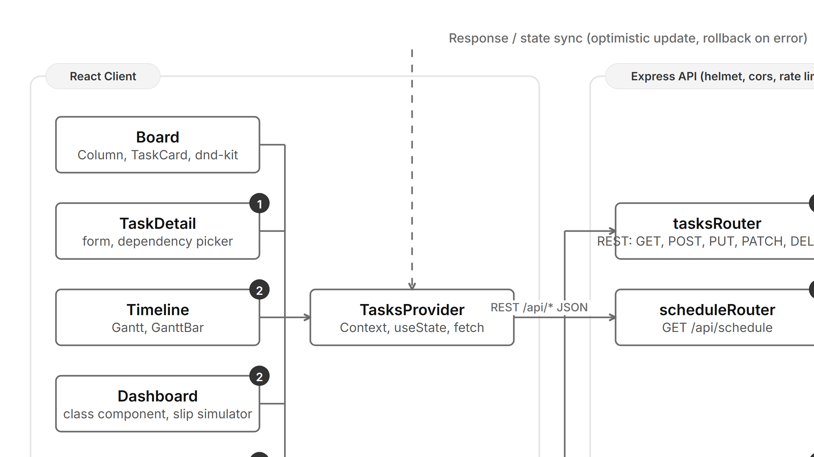

# SlackBoard

SlackBoard is a production-tier Kanban board application that models task dependencies and computes the real project schedule using the **Critical Path Method (CPM)**. It also includes an AI Planning Copilot.

Built as a full-stack monorepo with an Express.js backend and a React client. 

## Features

- **Kanban board:** create, edit, delete, drag tasks across `Todo / In Progress / Done`
- **Dependency graph:** each task can depend on N other tasks
- **Cycle detection:** dependency edges that would create a cycle are rejected before creation
- **CPM engine:** computes ES, EF, LS, LF, and slack per task
- **Timeline View:** Gantt-style timeline view showing dependencies, slack bars, and critical path
- **Dashboard:** comprehensive KPIs, critical tasks list, slack distribution chart, and a live slip simulator
- **AI Copilot:** generates project plans, assigns durations/dependencies, and answers schedule questions
- **Full-stack Monorepo:** shared CPM logic, Express server with Zod validation, Vite React client

## Tech Stack

### Client
- React 19 (Vite)
- `react-router-dom` v6 for routing
- `@dnd-kit` for drag and drop
- Tailwind CSS with custom design token system
- `lucide-react` for icons

### Server
- Express.js
- `zod` for request validation
- `groq-sdk` for the Copilot (`openai/gpt-oss-120b`)
- `express-rate-limit` and `helmet` for security
- JSON file persistence (`server/data/db.json`)

### Shared
- Pure TypeScript CPM engine used by both client and server

## Getting Started

1. **Install dependencies:**
```bash
npm install
```

2. **Set up environment variables:**
```bash
cp .env.example .env
# Add your Groq API key to .env if you want to use the real AI Copilot (otherwise it runs in mock mode)
```

3. **Start the development servers:**
```bash
npm run dev
```

The client will be available at http://localhost:5173/ and the server at http://localhost:3001/.

## Architecture


*Figure 1: SlackBoard system architecture*

- **`@slackboard/shared`:** The core CPM engine, types, and seed data.
- **`@slackboard/server`:** Express API server. Validates requests, ensures acyclic dependencies, and persists data.
- **`@slackboard/client`:** React SPA. Uses optimistic updates and a read-through cache for instant UI interactions.

## The Scheduling Engine

Three passes over the dependency DAG:

1. **Topological sort** (Kahn's algorithm) — orders tasks so dependencies always come before dependents. Fails if a cycle is present.
2. **Forward pass** — `ES = max(EF of all dependencies)` (0 if none), `EF = ES + duration`.
3. **Backward pass** — `LF = min(LS of all dependents)` (project end if none), `LS = LF - duration`.

`Slack = LS - ES`. Slack `0` → task is on the **critical path**: any delay to it delays the whole project. Slack `> 0` → task has float, can slip by that much without affecting the deadline.

## Assignment Notes (CIE-2)

- **Tutorial Deviation (`@dnd-kit` vs `react-dnd`):** The assignment suggested following a React Trello clone tutorial (which frequently relies on the legacy `react-dnd` library). I elected to use `@dnd-kit` instead, as it is a modern, accessible, and maintained standard for React drag-and-drop. The core Kanban layout and state management pattern from the tutorials were retained, but the drag engine was upgraded to meet production-tier standards.
- **Modeling Semantics (Baseline Plan vs Progress):** The CPM engine currently models the **baseline plan**. Therefore, moving a task to the "Done" column does not alter the project's projected end date (it continues to consume its planned duration in the schedule). This is an intentional design choice for baseline tracking, as opposed to a "remaining duration" model where completed tasks count as 0d.

## License
MIT
